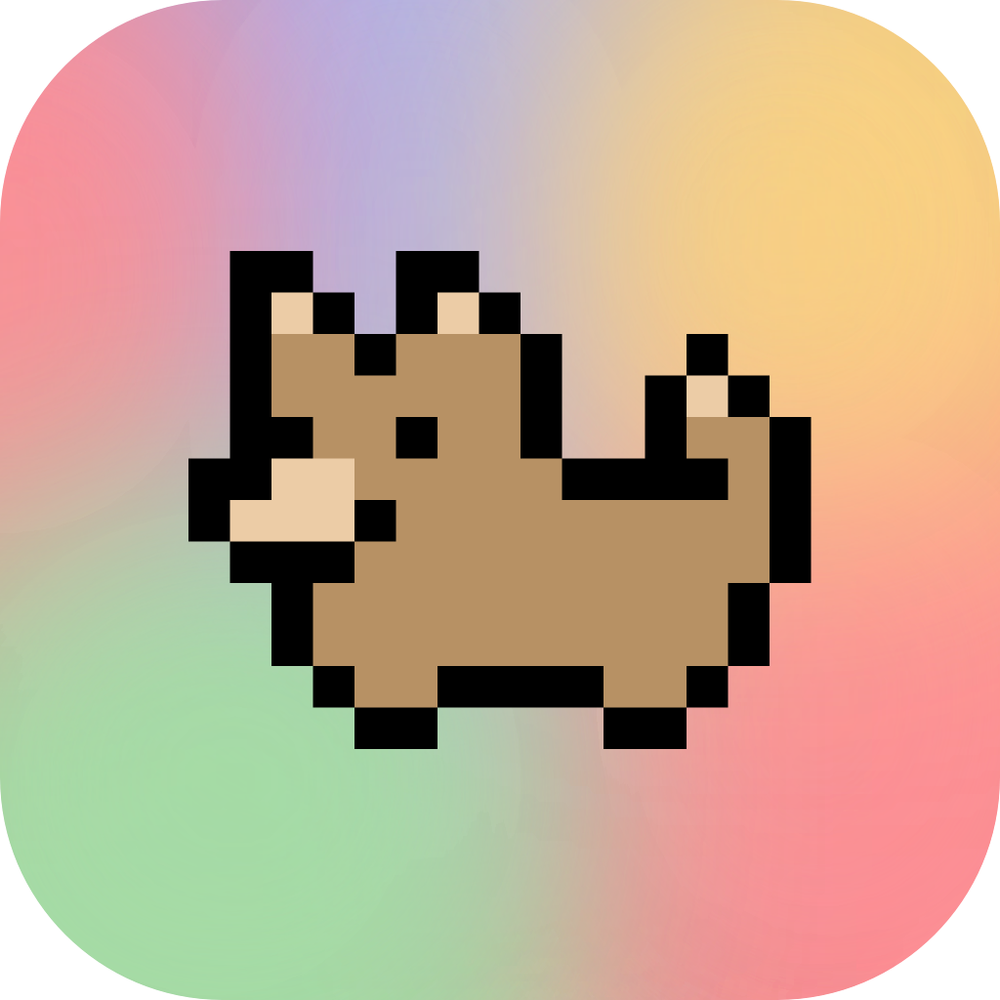
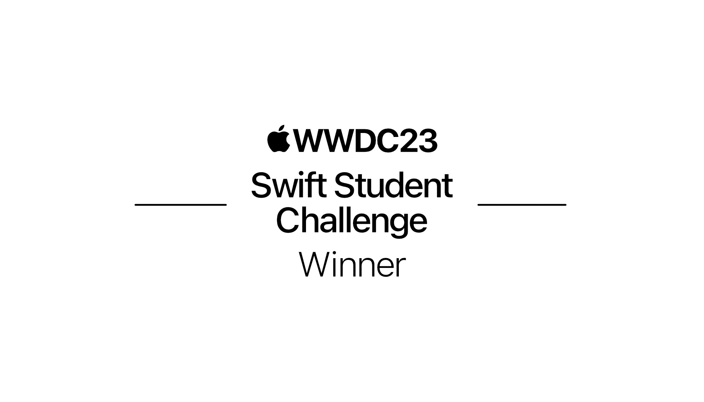

<h1> PawTask
  
</h1>

  
  

## About
PawTask is an app that teaches users some basic principles about organization and that helps them manage their tasks and plan their day. You'll be introduced to the app features by Cooper, the app's dog, and, after adding your tasks, and organizing them by priority, the app can plan which tasks you'll be able to do in the time you have for the day!

This aplication can help people by doing most of their planning automatically, saving them time, that can be better spent with friends, family or getting ahead of their tasks, while also providing more peace of mind and reducing daily anxiety.

## Run device
The app was made, primarly for iPhone devices in vertical orientation.
The app still does not fully support dark mode.

## Assets and sound
All of the app assets were made by me, and the done sound was also recorded by me.

## Features
- [x] Add any task you'd like, with a title, a description and a time estimative for it
- [x] Ability to edit all of the details of each task
- [x] Sort your tasks based on your priorities, so that the most important ones are done first
- [x] Earn coins and customize Cooper by buying him apparel
- [x] No internet required to run the app
- [x] Reminders to take a break after completing long tasks
- [x] Simple and minimal design

## Next Features
- [ ] Add support for different projects, in which tasks can be organized 
- [ ] Find a better and more secure way to store the user's tasks
- [ ] Finish dark mode support
- [ ] Add even more things to buy with the coins, and add app color customizations
- [ ] Add task deadlines and auto-sorting
- [ ] Add support to plan for multiple days
